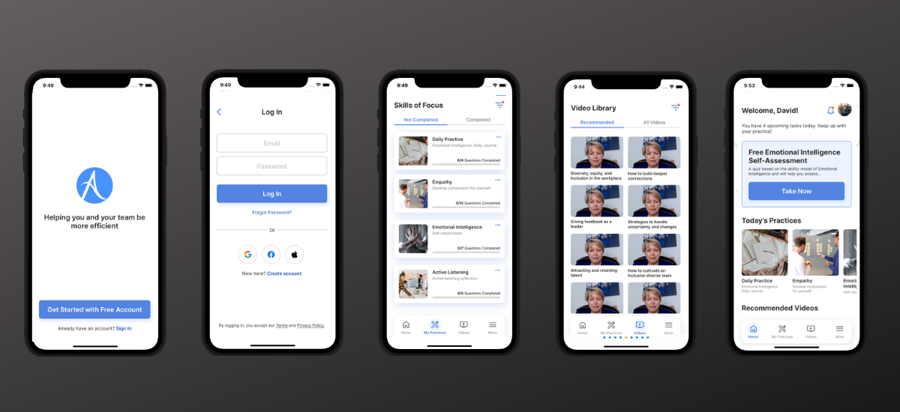
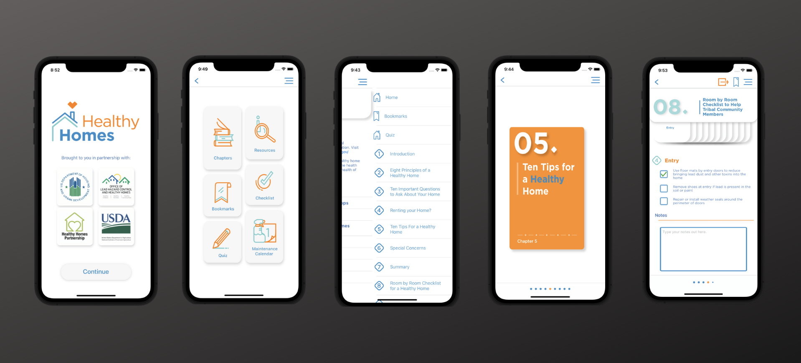

## Omni Departure
[Omni Air International](oai.aero) An internal application designed for OAI ground crews to streamline the cargo and passenger loading processes, convey essential data to relevant stakeholders, and optimize backend operations.

Developed as the sole mobile developer on the team performing frontend and backend work. Involves multiple iOS SDKs (SwiftUI, Combine, PDFKit, AVKit, CoreData) as well as leveraging 3rd party packages (Fastlane, SwiftLint). Backend development was completed using C# and SQL Server.

##### 🔨Technologies: SwiftUI, SQL Server, XCTests, 
##### 🚀Platform: 📱iPad

## Amotions Inc. [In Production]
[Amotions Inc.](https://www.amotionsinc.com/) transforms organizations by installing new daily habits and  Growing, engaging, and retaining next-generation leaders. This iOS app is used to suppplement the Amotions coursework with easy access. 

Developed as a team member of the mobile division, as well as worked on developing the backend using AWS and Python.

##### 🔨Technologies: UIKit, SwiftUI, XCTests, Firebase
##### 🚀Platform: 📱iOS, iPad

## Healthy Homes
[Tribal Healthy Homes](https://apps.apple.com/us/app/your-tribal-healthy-home/id1552775836) works to help Tribal citizens’ homes stay free of health and safety hazards and can substantially promote the well-being of residents. This new app highlights various hazards that are most common in Tribal housing, and the steps residents can take to eliminate these hazards. These hazards often relate to substandard ventilation systems, and others such as lead, unsafe use of poisons, and more.

Developed for the U.S. Department of Housing and Urban Development using Swift and UIKit. I was the sole developer on this app.

##### 🔨Technologies: UIKit, UI + Unit Tests
##### 🚀Platform: 📱iOS

## DCA Calculator
A dollar cost averaging calculator to project potential returns for financial assets like stocks, equities & ETFs. This app was a personal project to gain an introductory insight into FinTech utilizing the Alpha Vantage stock API.

Developed as a personal project.

##### 🔨Technologies: UIKit, UI + Unit Tests
##### 🚀Platform: 📱iOS

## BaseMetrics
[BaseMetrics](https://apps.apple.com/us/app/basemetrics/id1545402923) Study app is designed as a personal preventive heart health guide for aging adults. The app provides heart health education and helps to keep track of key biometrics for study participants.

Developed as a team member through the Oklahoma State App Center for a study conducted by the university.

##### 🔨Technologies: UIKit, Firebase, UI + Unit Tests
##### 🚀Platform: 📱iOS

